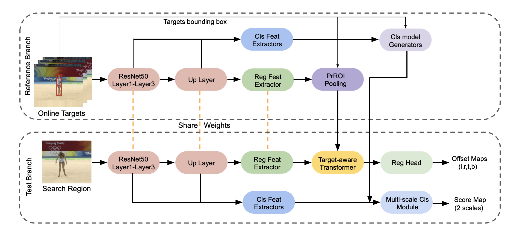

# Target Transformed Regression for Accurate Tracking
The official implementation of TREG using PyTorch. 

[[paper]](https://arxiv.org/abs/2104.00403)

[comment]: <> ([[model]]&#40;https://drive.google.com/drive/folders/1-TKOF4sKzUUb6C6XfM-rDjrBoEFhovEf?usp=sharing&#41;)



## Table of Contents

* [Overview](#overview)
* [Installation](#installation)
* [Training](#training)
* [Test and evaluation](#test-and-evaluation)
* [Citation](#Citation)

## Overview
In this repo, we provide pretrained model, training and inference code for TREG.

## Installation
Please refer to [INSTALL.md](INSTALL.md) for installation instructions.
We recommend using the [install script](install.sh). Before running the installation script,
make sure you have installed conda with python 3.7 and cuda10.0. And our platform is ubuntu 18.04.
```
./install.sh YOUR_CONDA_INSTALL_PATH ENVIRONMENT_NAME
```

## Training
We use [Lasot](https://cis.temple.edu/lasot/), [GOT-10k](http://got-10k.aitestunion.com), [TrackingNet](https://tracking-net.org) 
and [COCO](http://cocodataset.org/#home) to train TREG.
```
cd bash
./train_treg.sh
```

## Test and evaluation
In the pytracking directory, you can test trackers on a set of datasets and use integrated evaluation APIs to evaluate the tracking results. 

**1. Run the tracker on a set of datasets**

```
cd bash
./run_treg_on_otb.sh
```

See scripts under `bin` for the more supported datasets.

**2. Evaluate the tracking results on datasets**

```
cd bash
./eval_treg_on_otb.sh
```

See scripts under `bin` for the more scripts to evaluate on other datasets.

For **GOT-10k**, **TrackingNet**, you need to evaluate results on official server, we provide tools to pack tracking results into the zipfile of submission format. Also, put the tracking results under `results_path/treg`, you can use the script to pack trackingnet results:

```
cd bash
./pack_results_on_tn.sh
```

The packed zipfile can be found in the path `packed_results_path` that you set in local.py.


## Citation
Please consider citing our paper in your publications if the project helps your research.
```bibtex
@article{treg2021,
  author    = {Yutao Cui and
               Cheng Jiang and
               Limin Wang and
               Gangshan Wu},
  title     = {Target Transformed Regression for Accurate Tracking},
  journal   = {CoRR},
  volume    = {abs/2104.00403},
  year      = {2021}
}
```